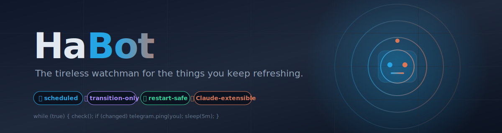

<p align="center">
  
</p>

# HaBot 🤖

> **Your tireless watchman.** HaBot keeps refreshing the internet so you don't have to — and pings you on Telegram the moment something you care about changes.

<p align="center">
  
  
  
  
  
</p>

---

## ✨ The vibe

You know that thing you keep checking? The product that's *almost* back in stock. The class that opens registration "soon." The page that *might* drop the announcement today.

HaBot does the checking. You get the notification.

```
┌────────────────────────────────────────────┐
│  You              HaBot           Source   │
│   │                 │                │     │
│   │  /subscribe URL │                │     │
│   │ ───────────────▶│                │     │
│   │                 │   poll (5m)    │     │
│   │                 │ ──────────────▶│     │
│   │                 │   "out"        │     │
│   │                 │ ◀──────────────│     │
│   │                 │   poll (5m)    │     │
│   │                 │ ──────────────▶│     │
│   │                 │   "IN STOCK"   │     │
│   │                 │ ◀──────────────│     │
│   │   📲 alert!     │                │     │
│   │ ◀───────────────│                │     │
└────────────────────────────────────────────┘
```

That's it. That's the bot.

## 🎯 What problem does it solve?

Modern life has a lot of "refresh and hope" moments:

- 🛒 **Restocks** — that GPU, that toy, that obscure component
- 🎟️ **Registrations opening** — kids' classes, community events, niche workshops
- ✈️ **Travel windows** — a flight, a route, a price
- 📰 **Page changes** — a job posting, a status page, a public dataset

Each one has its own little website. Each website forgets about you the second you close the tab. HaBot remembers, and only speaks up when something actually changed — **transition detection only, no duplicate noise.**

## 🏗️ How it's built

HaBot is a thin **domain layer** on top of [TeleClaude](https://github.com/ofir5300/teleclaude) — a Telegram bot framework that wires Claude Code into a Telegram chat with plan/approve/reject flow, voice transcription, and self-restart.

```
        ┌────────────────────────────────────────────┐
        │                  Telegram                  │
        └────────────────────┬───────────────────────┘
                             │
                ┌────────────▼────────────┐
                │   TeleClaude (base)     │   ← polling, auth, /claude,
                │   • plan mode           │     /approve, voice → Whisper,
                │   • Claude Code session │     self-restart
                └────────────┬────────────┘
                             │ extends
                ┌────────────▼────────────┐
                │   HaBot (this repo)     │   ← /subscribe, /list, /stock,
                │   habot_bot.py          │     /filters, broadcast
                └────────────┬────────────┘
                             │
       ┌─────────────────────┼─────────────────────┐
       │                     │                     │
 ┌─────▼─────┐         ┌─────▼─────┐         ┌─────▼─────┐
 │  monitor  │         │ scheduler │         │ checkers/ │
 │  state +  │◀────────│ APSched.  │────────▶│  ksp,     │
 │  subs     │         │  jobs     │         │  events,  │
 └───────────┘         └───────────┘         │  flights, │
                                             │  …        │
                                             └───────────┘
```

**Sync everywhere.** No asyncio gymnastics. APScheduler runs the polls; raw `requests` talks to Telegram. The whole thing fits in your head.

## 🧩 Adding a new "watcher" — two ways

### The boring way (write code)

Drop a file in `checkers/`, subclass `Checker`, register it. Five minutes.

```python
from checkers import Checker, StockResult, register

class MyChecker(Checker):
    @property
    def source_name(self) -> str:
        return "mysource"

    def check(self, item_id: str) -> StockResult:
        return StockResult(in_stock=True, price=42.0, name="Thing", url="...")

register(MyChecker())
```

### The fun way (let Claude write it)

Send the bot a URL it doesn't recognize. Claude Code enters **plan mode**, proposes a checker, you reply `/approve`, the file gets written, the bot restarts itself, and the new source is live.

```
You: https://some-cool-site.example/event/1234
Bot: I don't know this source. Here's a plan to add it… [proposes diff]
You: /approve
Bot: ✅ wrote checkers/somecoolsite.py — restarting…
Bot: 🟢 back online, monitoring 1 new source
```

Yes — really.

## 🚀 Run it

```bash
cp .env.example .env          # set TELEGRAM_BOT_TOKEN + ALLOWED_CHAT_IDS
pip install -r requirements.txt
python main.py
```

Or deploy as a systemd service — see [`deploy/`](./deploy/) for the unit file and the daily auto-update timer (it pulls + restarts itself overnight).

## 📊 What's in the box

| Piece | Job |
|---|---|
| `habot_bot.py` | Telegram surface — commands, callbacks, broadcast |
| `main.py` | Entrypoint — wires scheduler + polling |
| `monitor.py` | State, subscribers, checker orchestration |
| `checkers/` | One file per source. Pluggable. |
| `url_parser.py` | URL → `(source, item_id)` |
| `config.py` | Env knobs |
| `state.json` | Persisted across restarts so you never get duplicate pings |

## 🤝 Trust

A monitor is only useful if you can rely on it. HaBot earns that by:

- 💾 **Persisting state** — restart-safe. Your subscriptions and last-seen state survive a reboot.
- 🔁 **Self-healing** — systemd restarts on crash; daily timer pulls latest code.
- 🎯 **Transition-only alerts** — pings you on `false → true`, never on every poll.
- 👥 **Multi-user with auth** — only `ALLOWED_CHAT_IDS` get in.
- 🧪 **Tiny surface, easy to read** — the entire domain layer is a handful of files.

## 📜 License

MIT.

---

<p align="center"><sub>Built quietly on a Raspberry Pi · powered by Claude Code · pings you only when it matters</sub></p>
